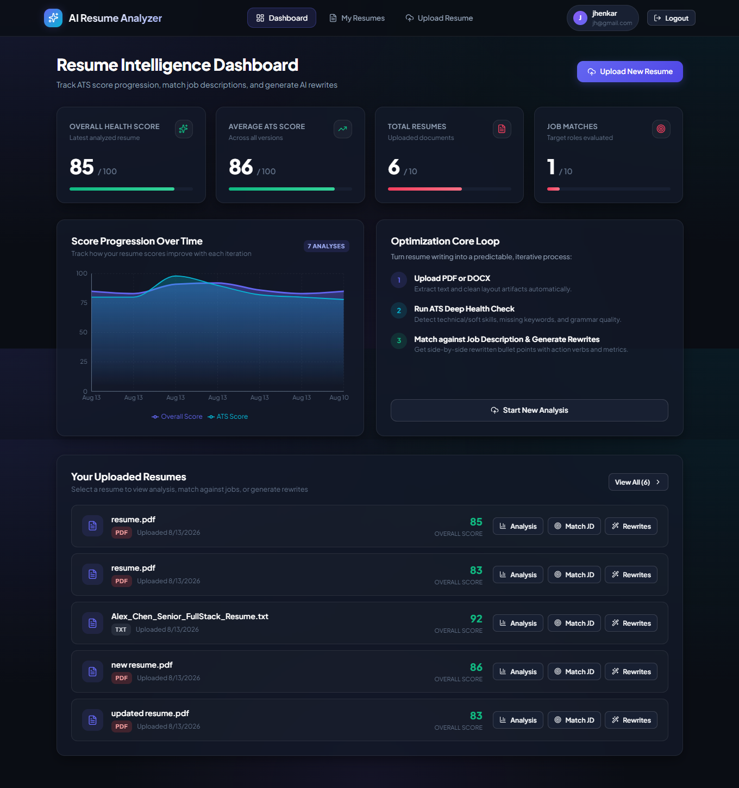
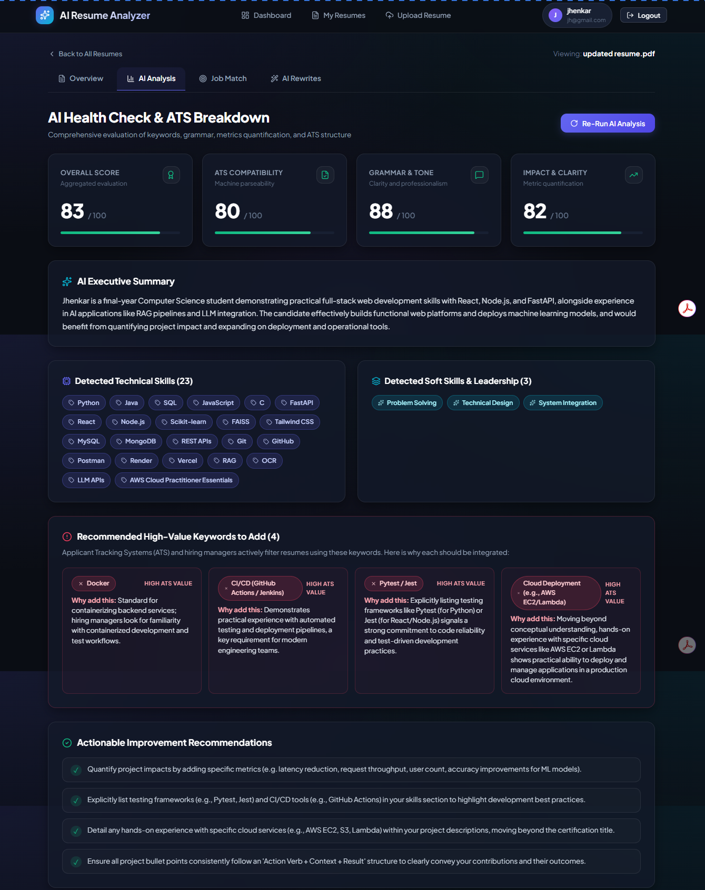
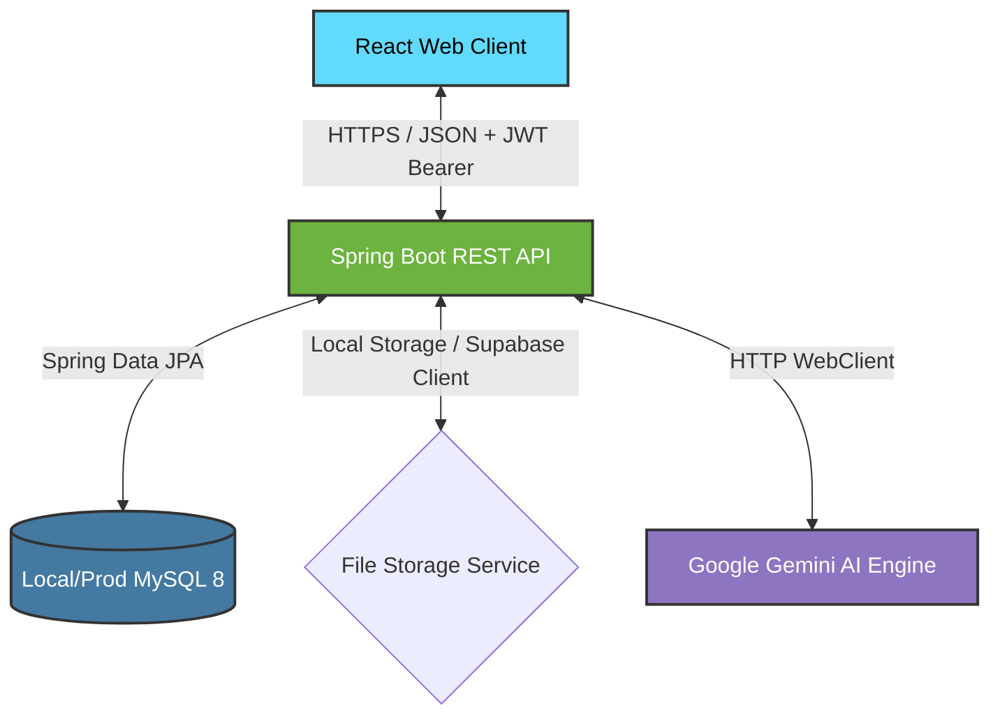

# 📄 AI Resume Analyzer

> **Transform your job search from a guessing game into an iterative, data-driven science.**

AI Resume Analyzer is a modern, full-stack web application designed to help job seekers audit, refine, and tailor their resumes. Unlike traditional tools that provide static, one-time scores, this platform stores a complete analysis history for every resume, enabling users to track their progress and score improvements over time.

---

## 📷 App Snapshots

### 1. Main Dashboard (Score Trends & Resumes List)
*Features a sleek glassmorphic dashboard tracking user performance over successive resume uploads, highlighting ATS, grammar, and job match metrics alongside historic trend lines.*



### 2. Experience Optimization & AI suggestions
*Enables users to review detailed original versus AI-improved resume lines side-by-side, complete with highlighted target keywords, quantification adjustments, and action-verb improvements.*



---

## 🗺️ Table of Contents

1. [Features](#-features)
2. [Tech Stack](#-tech-stack)
3. [System Architecture](#-system-architecture)
4. [Database Schema](#-database-schema)
5. [Local Development Setup](#-local-development-setup)
   - [Prerequisites](#prerequisites)
   - [Database Setup](#1-database-setup)
   - [Backend Setup](#2-backend-setup)
   - [Frontend Setup](#3-frontend-setup)
6. [Docker Development Setup](#-docker-development-setup)
7. [Deployment Guide](#-deployment-guide)
   - [Backend Deployment (Render Blueprint)](#1-backend-deployment-render)
   - [Frontend Deployment (Vercel)](#2-frontend-deployment-vercel)
   - [Environment Variables Directory](#environment-variables-directory)
8. [Smoke Testing](#-smoke-testing)

---

## ✨ Features

- 📈 **Score Trend Tracking:** Every analysis is stored historically, enabling an interactive Recharts line chart that illustrates score improvements over time.
- 🤖 **ATS & Grammar Audit:** High-fidelity resume evaluations powered by Google Gemini (`gemini-2.5-flash`), grading professional summaries, technical/soft skills, grammar, and formatting.
- 🎯 **Job Description Matching:** Paste any external job description to obtain a match percentage, list of matching skills, and highlighted missing keywords.
- ✍️ **AI Resume Rewrites (Improver):** Generates targeted, quantified bullet points for your experience entries and a rewritten professional summary.
- 🔐 **JWT Auth System:** Secure registration and stateless session logins using Spring Security and signed JSON Web Tokens.
- 📁 **Dual Storage Modes:** Automatically defaults to local disk file storage for easy development, with plug-and-play support for Supabase Bucket storage in production.

---

## 🛠️ Tech Stack

| Layer | Technology | Description |
|---|---|---|
| **Backend** | Java 17, Spring Boot 3.3 | RESTful API built on Spring Boot, with Spring Security & JWT stateless auth. |
| **Frontend** | React 18 (Vite), CSS3 | Component-driven UI styled with custom CSS and animated using Recharts. |
| **Database** | MySQL 8.0 | Relational database containing users, resumes, analyses, matches, and rewrites. |
| **ORM** | Hibernate (Spring Data JPA) | Handles database mapping and automatic schema generation. |
| **AI Integration** | Google Gemini API | Communicates with `gemini-2.5-flash` using strict JSON schemas. |
| **Document Parsing** | Apache PDFBox, Apache POI | Robust raw text extraction from PDF and DOCX documents directly on the server. |

---

## 📐 System Architecture

The application is built on a clean three-tier architecture model:



### Request Lifecycle Example (Resume Analysis):
1. **Upload:** Client sends resume file (`.pdf`/`.docx`) to `/api/resumes/upload`. The backend parses the text using Apache PDFBox/POI and stores the raw text + file path.
2. **Analysis Trigger:** Client calls `POST /api/analysis/{resumeId}`.
3. **AI Evaluation:** Backend compiles the resume text into a highly structured prompt, queries Gemini API, validates the returned JSON, and logs the analysis.
4. **Data Persistence:** The evaluation is stored in the database as an independent history row.
5. **Dashboard Rendering:** React fetches the score history using `GET /api/analysis/{resumeId}/history` and populates the trends chart.

---

## 🗄️ Database Schema

The database consists of 5 main tables, linked transitively to `users`:

```
users (1) ──< resumes (many)
             ├──< analyses (many)              -- Append-only score history
             ├──< job_matches (many)           -- Past JD matches
             └──< resume_improvements (many)   -- Versioned AI rewrites
```

- **`users`**: Holds email identifiers, BCrypt password hashes, and user roles.
- **`resumes`**: Stores file names, file paths (disk or Supabase URL), and extracted raw text.
- **`analyses`**: Append-only log of AI assessment metrics (overall score, ATS score, grammar score, suggestions, and skill tags).
- **`job_matches`**: Matches resumes against pasted job descriptions, capturing match percentages and keyword gaps.
- **`resume_improvements`**: Houses versioned AI-rewritten professional summaries and experience lines.

> [!NOTE]
> The database schema is fully managed by Hibernate. On first run, it will automatically bootstrap the database and create all tables and indexes.

---

## 💻 Local Development Setup

### Prerequisites
Make sure you have the following installed:
- **Java Development Kit (JDK) 17** (or above)
- **Apache Maven 3.8+**
- **Node.js v18+** & **npm**
- **MySQL Server 8.0**

---

### 1. Database Setup
Create the database and configure local user privileges. Run the following commands in your MySQL CLI (or database manager):

```sql
CREATE DATABASE IF NOT EXISTS resume_analyzer;
CREATE USER IF NOT EXISTS 'ai_resume'@'localhost' IDENTIFIED BY 'airesume';
GRANT ALL PRIVILEGES ON resume_analyzer.* TO 'ai_resume'@'localhost';
FLUSH PRIVILEGES;
```

---

### 2. Backend Setup
1. Navigate to the backend directory:
   ```bash
   cd backend
   ```
2. Create a `.env` file in the `backend` folder to configure your Google Gemini API Key and local credentials (see [Environment Variables Reference](#environment-variables-directory)):
   ```env
   SPRING_DATASOURCE_URL=jdbc:mysql://localhost:3306/resume_analyzer?createDatabaseIfNotExist=true&allowPublicKeyRetrieval=true&useSSL=false&serverTimezone=UTC
   SPRING_DATASOURCE_USERNAME=ai_resume
   SPRING_DATASOURCE_PASSWORD=airesume
   JWT_SECRET=your-32-character-long-local-jwt-secret-key-goes-here
   GEMINI_API_KEY=AIzaSy...your-actual-gemini-key
   ```
3. Build the backend using Maven:
   ```bash
   mvn clean package -DskipTests
   ```
4. Run the Spring Boot application:
   ```bash
   mvn spring-boot:run
   ```
   *The backend server will launch on `http://localhost:8080`.*

---

### 3. Frontend Setup
1. Navigate to the frontend directory:
   ```bash
   cd frontend
   ```
2. Install the frontend dependencies:
   ```bash
   npm install
   ```
3. Run the development server:
   ```bash
   npm run dev
   ```
   *The Vite client will launch on `http://localhost:3000`.*
   *Frontend contains automatic local development proxies sending `/api/*` calls to `http://localhost:8080`.*

---

## 🐳 Docker Development Setup

If you prefer to run the entire application using containers, a preconfigured `docker-compose.dev.yml` is provided at the repository root.

1. Configure the `GEMINI_API_KEY` env variable in the compose file or on your host terminal.
2. Run the following command from the root directory:
   ```bash
   docker-compose -f docker-compose.dev.yml up --build
   ```
3. This boots:
   - **MySQL database** on port `3306`
   - **Java Backend** on port `8080`
   - **Vite React App** on port `3000`

---

## 🚀 Deployment Guide

### 1. Backend Deployment (Render)
The repository is pre-configured with a Render Blueprint (`render.yaml`).

1. Push your code to your GitHub repository.
2. Log in to the [Render Dashboard](https://dashboard.render.com).
3. Click **New** ➡️ **Blueprint**.
4. Connect your GitHub repository.
5. Render will automatically read the `render.yaml` configuration and set up a Web Service.
6. Provide the required production environment variables in the Render console (see variables table below).
7. Approve the deployment. Render will build the container using `backend/Dockerfile` and host it.

---

### 2. Frontend Deployment (Vercel)
The React app is configured with `vercel.json` to manage single-page application (SPA) client-side routing.

1. Import your frontend project into the [Vercel Dashboard](https://vercel.com).
2. Set the **Framework Preset** to `Vite`.
3. Set the **Root Directory** to `frontend`.
4. Configure the **Build Command** to `npm run build` and **Output Directory** to `dist`.
5. Add the environment variable:
   - `VITE_API_URL` = (Your deployed Render backend URL, e.g. `https://resume-backend.onrender.com`)
6. Click **Deploy**.

---

### Environment Variables Directory

| Env Variable | Scope | Required? | Default / Example | Purpose |
|---|---|---|---|---|
| `SPRING_DATASOURCE_URL` | Backend | Yes | `jdbc:mysql://localhost:3306/resume_analyzer...` | JDBC URL for connection to MySQL |
| `SPRING_DATASOURCE_USERNAME`| Backend | Yes | `ai_resume` | MySQL username |
| `SPRING_DATASOURCE_PASSWORD`| Backend | Yes | `airesume` | MySQL password |
| `JWT_SECRET` | Backend | Yes | `change-this-to-a-long-random-secret-key-32-bytes` | Token signing secret key |
| `GEMINI_API_KEY` | Backend | Yes | — | Google Gemini API Access Token |
| `SUPABASE_URL` | Backend | No | `https://yourproj.supabase.co` | Supabase endpoint for cloud file storage |
| `SUPABASE_KEY` | Backend | No | `sb_secret_...` | Supabase API security key |
| `SUPABASE_BUCKET` | Backend | No | `resumes` | Name of Supabase storage bucket |
| `VITE_API_URL` | Frontend | Yes (Prod)| `https://api.yourdomain.com` | Deployed backend API base endpoint |

> [!TIP]
> If `SUPABASE_URL` and `SUPABASE_KEY` are left blank, the backend automatically falls back to storing uploaded files on the local server disk (`/uploads`). This makes local development zero-overhead.

---

## 🧪 Smoke Testing

You can run an automated end-to-end smoke test verifying authentication, file uploads, text extraction, and database persistence:

1. Start both the backend and frontend.
2. In the root directory, run the smoke test runner (requires Node 18+):
   ```bash
   node scripts/smoke-test.js
   ```
3. To test a remote or custom endpoint, set the `BACKEND_URL` environment variable:
   ```bash
   $env:BACKEND_URL="https://your-backend.onrender.com"  # Windows PowerShell
   node scripts/smoke-test.js
   ```
